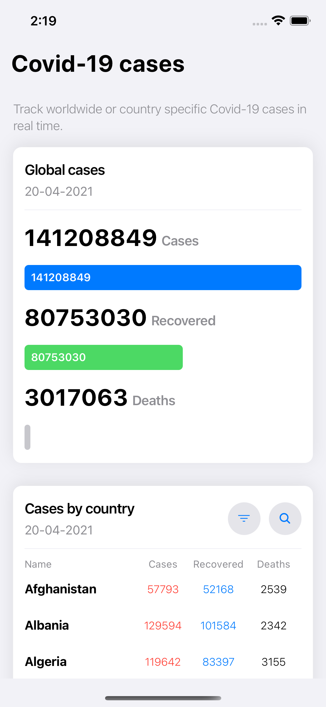
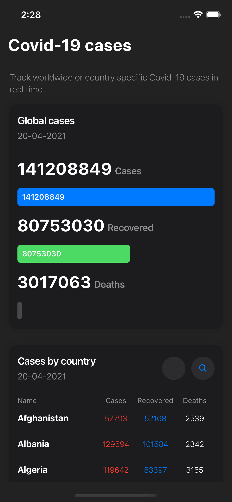
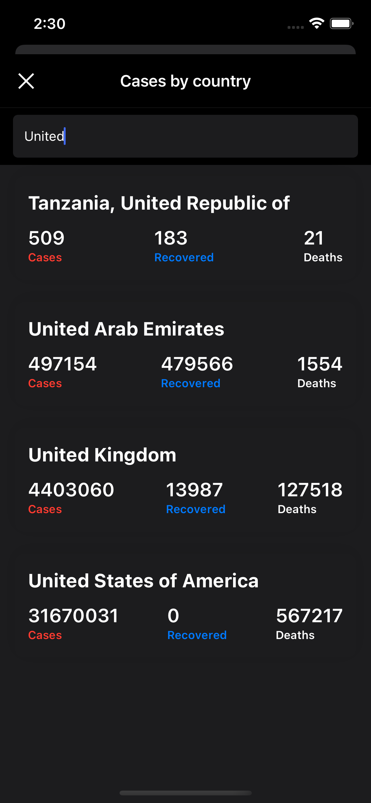
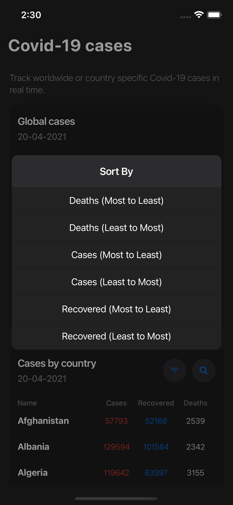
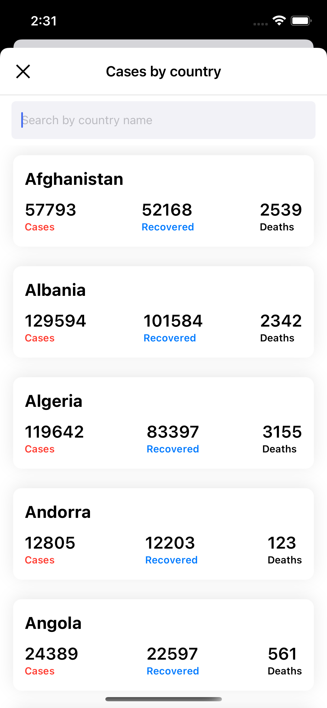

# Covid-19 Cases tracking app

A simple app to show latest Covid-19 cases with the ability to search and rank countries by the number of cases, deaths and recoveries.

built with [React-Native](https://github.com/facebook/react-native) for iOS and Android, with dark mode support, custom design system and theming using [Styled-Components](https://www.styled-components.com/) all combined with [Wix  React-Native-Navigation](https://github.com/wix/react-native-navigation/).

## Stack

[React-Native](https://github.com/facebook/react-native)

[React-Native-Navigation](https://github.com/wix/react-native-navigation/)

[react-query](https://react-query.tanstack.com)

[TypeScript](https://www.typescriptlang.org/)

[Styled-Components](https://www.styled-components.com/)

[react-native-typography](https://github.com/hectahertz/react-native-typography)

[react-native-vector-icons](https://github.com/oblador/react-native-vector-icons/issues)

## Preview

<p align="center">
  
  
  
  
  
</p>

## Running the app

```bash
$ yarn

$ cd ios && pod install && cd ..

$ react-native run-ios
```

## Contribute

Open for new ideas, features you want to add or things you want to discuss regarding the app implementaion or if you have a better structure implementation in mind please let me know by opening an issue, PR, or messaging me on [Twitter](https://twitter.com/hussein_dev).
